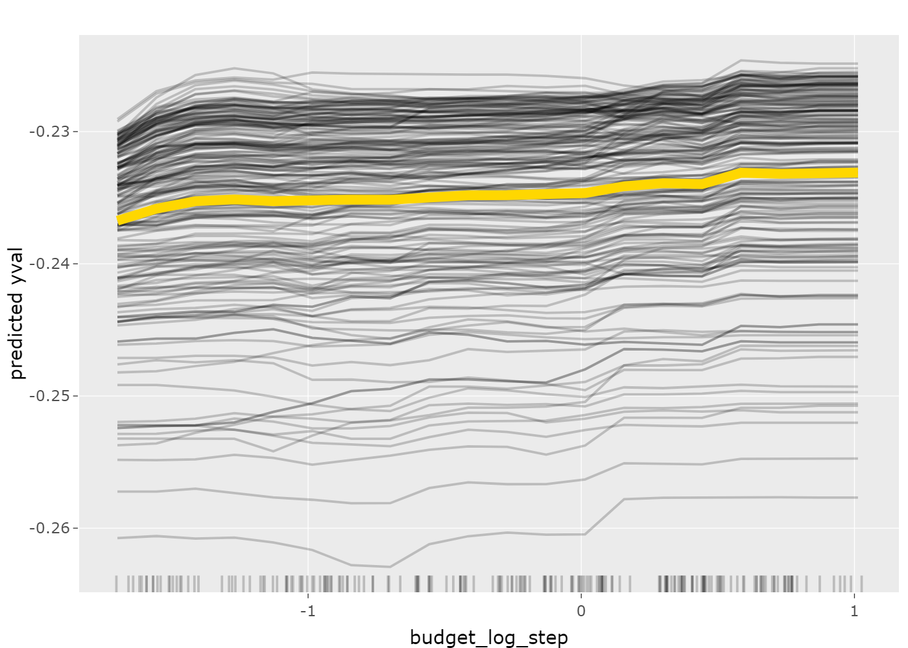

<!-- README.md is generated from README.Rmd. Please edit that file -->

 ```{r, include = FALSE, warning = FALSE, messages = FALSE}
 knitr::opts_chunk$set(
 collapse = TRUE,
 comment = "#>",
 fig.path = "man/figures/",
 out.width = "100%"
 )
 ```

# VisHyp

<!-- badges: start -->
[](https://github.com/Pizzaknoedel/visualize-hyperparameter/actions)
<!-- badges: end -->

The goal of the "VisHyp" package is to visualize hyperparameter performance dependencies in order to detect which hyperparameter configurations deliver the best performances. For this purpose, the following four plots were implemented: partial coordinate plot (PCP), partial dependence plot (PDP), importance plot and heatmap. 

## Installation

You can install the development version of "VisHyp" from [GitHub](https://github.com/) with:

```r
# install.packages("devtools")
devtools::install_github("Pizzaknoedel/visualize-hyperparameter")
library(VisHyp)
```
## Shiny 

To launch the Shiny application included in the package, run the following function after loading the package: 

```r
launchVisHyp()
```

## Example

This is a basic example of how to visualize the four implementend methods. First, a task must be created for each plot using the [mlr3](https://github.com/mlr-org/mlr3) package.

```r 
## Create a Task
library(mlr3)
task <- TaskRegr$new(id = "task_glmnet", backend = smashy_super, target = "yval")
```

Parallel coordinate plot: In the PCP, each line represents a configuration and its color represents the corresponding performance value. The PCP is helpful to find configuration spaces that contain good performance values.
```r 
## Display a PCP 
plotParallelCoordinate(task, labelangle = 15)
```


Heatmap: The heatmap contrasts two parameters and allows a quick examination of the effects of each configuration combination. 

```r 
## Display a Heatmap 
plotHeatmap(task, c("random_interleave_fraction", features = "sample"))
```


Importance Plot: The importance plot can be used to figure out which parameter tends to be more important and should therefore be considered for further investigations with other methods.

```r 
## Display an Importance Plot 
plotImportance(task)
```


Partial dependence plot: The PDP uses different graphics, so it depends on whether the user wants to look at one or more features. When viewing a numerical parameter, line plots are used. 

```r 
## Display a PDP 
plotPartialDependence(task)
```



