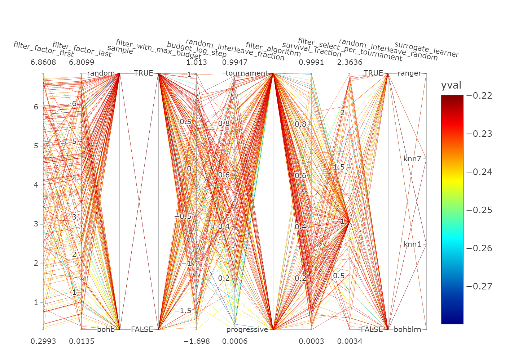
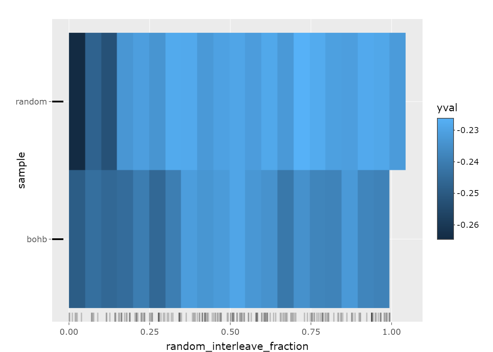
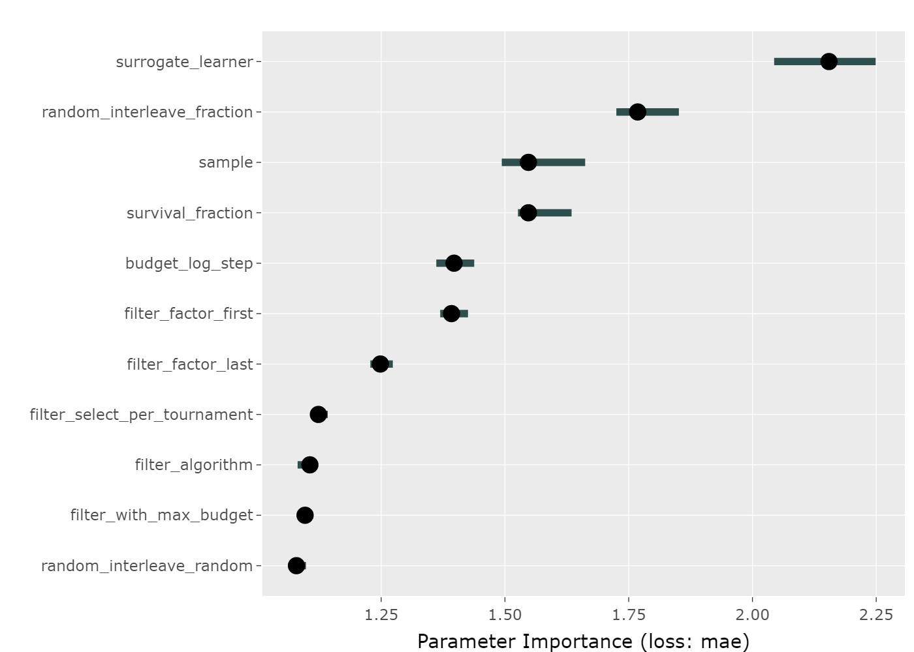

<!-- README.md is generated from README.Rmd. Please edit that file -->

# VisHyp

<!-- badges: start -->

[](https://github.com/Pizzaknoedel/visualize-hyperparameter/actions)
<!-- badges: end -->

The goal of the “VisHyp” package is to visualize hyperparameter
performance dependencies in order to gain insight into which
hyperparameter configurations deliver the best performance. For this
purpose, the following four plots were implemented: The Partical
Coordinate Plot (PCP), the Partial Dependence Plot (PDP), the Importance
Plot and the Heatmap.

## Installation

You can install the development version of VisHyp from
[GitHub](https://github.com/) with:

``` r
# install.packages("devtools")
devtools::install_github("Pizzaknoedel/visualize-hyperparameter")
library(VisHyp)
```

## Shiny

To launch the Shiny application included in the package, execute the
following function after loading the package:

``` r
launchVisHyp()
```

## Example

This is a basic example which shows you how to plot the four implemented
graphics. Each plot needs a task created with the
[mlr3](https://github.com/mlr-org/mlr3) package.

``` r
## Create a Task
library(mlr3)
task = TaskRegr$new(id = "task_glmnet", backend = smashy_super, target = "yval")
```

In the Parallel Coordinate Plot, each line represents a configuration
and the color of the line represents the corresponding performance
value. The Parallel Coordinate Plot helps to find configuration spaces
that contain good performance values.

``` r
## Display a PCP 
plotParallelCoordinate(task, labelangle = 15)
```



Heatmap: The heat map contrasts two parameters and allows quick
examination of the effects of each configuration combination. The
importance plot uses a surrogate learner to represent the importance of
each parameter. plotHeatmap(task, gridsize = 10, features = c())

``` r
## Display a Heatmap 
plotHeatmap(task, c("random_interleave_fraction", features = "sample"))
```



Importance Plot: The important parameters should be set as optimal as
possible to get a good performance. To last still the partial Dependence
Plot was implemented, with which it is possible to examine the
individual definition areas of the parameters with the help of a
Surrogats model.

``` r
## Display an Importance Plot 
plotImportance(task)
```



PDP: The Partial Dependence Plot uses different graphics. So it depends
on whether the user wants to look at one or more features. When viewing
a numerical parameter, line plots are used. plotPartialDependence(task)

``` r
## Display a PDP 
plotPartialDependence(task)
```


