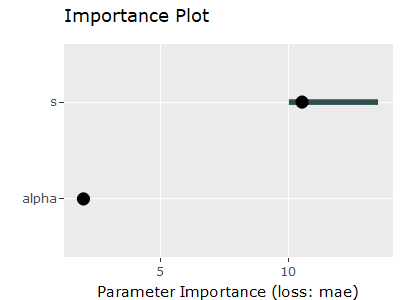
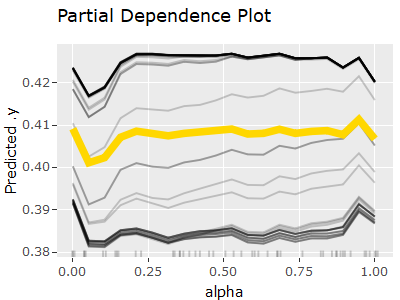

<!-- README.md is generated from README.Rmd. Please edit that file -->

# VisHyp

<!-- badges: start -->

[](https://github.com/Pizzaknoedel/visualize-hyperparameter/actions)
<!-- badges: end -->

The goal of the “VisHyp” package is to visualize hyperparameter
performance dependencies in order to gain insight into which
hyperparameter configurations deliver the best performance. For this
purpose, the following four plots were created: The Partical Coordinate
Plot (PCP), the Partial Dependence Plot (PDP), the Importance Plot and
the Heatmap.

## Installation

You can install the development version of VisHyp from
[GitHub](https://github.com/) with:

``` r
# install.packages("devtools")
devtools::install_github("Pizzaknoedel/visualize-hyperparameter")
```

## Example

This is a basic example which shows you how to plot the four implemented
graphics. Each plot needs a task created with the
[mlr3](https://github.com/mlr-org/mlr3) package.

``` r
## basic example code
library(VisHyp)
library(mlr3)
task = TaskRegr$new(id = "task_glmnet", backend = glmnet_ela, target = "logloss")

## PCP: In the Parallel Coordinate Plot, each line represents a configuration and the color of the line represents the corresponding performance value. The Parallel Coordinate Plot helps to find configuration spaces that contain good performance values. 
plotParallelCoordinate(task)
```


``` r

## Heatmap: The heat map contrasts two parameters and allows quick examination of the effects of each configuration combination. The importance plot uses a surrogate learner to represent the importance of each parameter.
plotHeatmap(task, gridsize = 5)
```


``` r

## Importance Plot: The important parameters should be set as optimal as possible to get a good performance. To last still the partial Dependence Plot was implemented, with which it is possible to examine the individual definition areas of the parameters with the help of a Surrogats model.
plotImportance(task)
#> Scale for 'x' is already present. Adding another scale for 'x', which will
#> replace the existing scale.
```



``` r

## PDP: The Partial Dependence Plot uses different graphics. So it depends on whether the user wants to look at one or more features. When viewing a numerical parameter, line plots are used. 
plotPartialDependence(task)
```



``` r
# After downloading the package it is also possible to visualize hyperparameter dependencies with an integrated shiny app. Just write
launchVisHyp()
```

What is special about using `README.Rmd` instead of just `README.md`?
You can include R chunks like so:

``` r
summary(cars)
#>      speed           dist       
#>  Min.   : 4.0   Min.   :  2.00  
#>  1st Qu.:12.0   1st Qu.: 26.00  
#>  Median :15.0   Median : 36.00  
#>  Mean   :15.4   Mean   : 42.98  
#>  3rd Qu.:19.0   3rd Qu.: 56.00  
#>  Max.   :25.0   Max.   :120.00
```

You’ll still need to render `README.Rmd` regularly, to keep `README.md`
up-to-date. `devtools::build_readme()` is handy for this. You could also
use GitHub Actions to re-render `README.Rmd` every time you push. An
example workflow can be found here:
<https://github.com/r-lib/actions/tree/v1/examples>.

You can also embed plots, for example:


In that case, don’t forget to commit and push the resulting figure
files, so they display on GitHub and CRAN.
