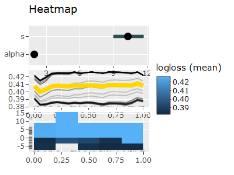

<!-- README.md is generated from README.Rmd. Please edit that file -->

# VisHyp

<!-- badges: start -->

[](https://github.com/Pizzaknoedel/visualize-hyperparameter/actions)
<!-- badges: end -->

The goal of the “VisHyp” package is to visualize hyperparameter
performance dependencies in order to gain insight into which
hyperparameter configurations deliver the best performance. For this
purpose the following four plots have been implemented: In the Parallel
Coordinate Plot, each line represents a configuration and the color of
the line represents the corresponding performance value. The Parallel
Coordinate Plot helps to find configuration spaces that contain good
performance values. The heat map contrasts two parameters and allows
quick examination of the effects of each configuration combination. The
importance plot uses a surrogate learner to represent the importance of
each parameter. The important parameters should be set as optimal as
possible to get a good performance. To last still the partial Dependence
Plot was implemented, with which it is possible to examine the
individual definition areas of the parameters with the help of a
Surrogats model. The Partial Dependence Plot uses different graphics. So
it depends on whether the user wants to look at one or more features.
When viewing a numerical parameter, line plots are used.

## Installation

You can install the development version of VisHyp from
[GitHub](https://github.com/) with:

``` r
# install.packages("devtools")
devtools::install_github("Pizzaknoedel/visualize-hyperparameter")
```

## Example

This is a basic example which shows you how to plot the four implemented
graphics.

``` r
library(VisHyp)
#> Warning: replacing previous import 'ggplot2::last_plot' by 'plotly::last_plot'
#> when loading 'VisHyp'
## basic example code
# Each plot needs a task created with the `mlr3` package. 
library(mlr3)
#> Warning: Paket 'mlr3' wurde unter R Version 4.0.5 erstellt
# A task needs to be created
task = TaskRegr$new(id = "task_glmnet", backend = glmnet_ela, target = "logloss")
```

``` r
library(plotly)
#> Warning: Paket 'plotly' wurde unter R Version 4.0.5 erstellt
#> Lade nötiges Paket: ggplot2
#> Warning: Paket 'ggplot2' wurde unter R Version 4.0.5 erstellt
#> 
#> Attache Paket: 'plotly'
#> The following object is masked from 'package:ggplot2':
#> 
#>     last_plot
#> The following object is masked from 'package:stats':
#> 
#>     filter
#> The following object is masked from 'package:graphics':
#> 
#>     layout


p1 <- plotImportance(task) 
#> Warning: Paket 'Rcpp' wurde unter R Version 4.0.5 erstellt
#> Warning: Paket 'paradox' wurde unter R Version 4.0.5 erstellt
#> Warning: Paket 'tidyr' wurde unter R Version 4.0.5 erstellt
#> Warning: Paket 'palmerpenguins' wurde unter R Version 4.0.5 erstellt
#> Warning: Paket 'digest' wurde unter R Version 4.0.5 erstellt
#> Warning: Paket 'utf8' wurde unter R Version 4.0.5 erstellt
#> Warning: Paket 'parallelly' wurde unter R Version 4.0.5 erstellt
#> Warning: Paket 'R6' wurde unter R Version 4.0.5 erstellt
#> Warning: Paket 'ranger' wurde unter R Version 4.0.5 erstellt
#> Warning: Paket 'backports' wurde unter R Version 4.0.5 erstellt
#> Warning: Paket 'pillar' wurde unter R Version 4.0.5 erstellt
#> Warning: Paket 'rlang' wurde unter R Version 4.0.5 erstellt
#> Warning: Paket 'uuid' wurde unter R Version 4.0.5 erstellt
#> Warning: Paket 'data.table' wurde unter R Version 4.0.5 erstellt
#> Warning: Paket 'rmarkdown' wurde unter R Version 4.0.5 erstellt
#> Warning: Paket 'mlr3pipelines' wurde unter R Version 4.0.5 erstellt
#> Warning: Paket 'htmlwidgets' wurde unter R Version 4.0.5 erstellt
#> Warning: Paket 'xfun' wurde unter R Version 4.0.5 erstellt
#> Warning: Paket 'Metrics' wurde unter R Version 4.0.5 erstellt
#> Warning: Paket 'htmltools' wurde unter R Version 4.0.5 erstellt
#> Warning: Paket 'tidyselect' wurde unter R Version 4.0.5 erstellt
#> Warning: Paket 'lgr' wurde unter R Version 4.0.5 erstellt
#> Warning: Paket 'mlr3misc' wurde unter R Version 4.0.5 erstellt
#> Warning: Paket 'fansi' wurde unter R Version 4.0.5 erstellt
#> Warning: Paket 'crayon' wurde unter R Version 4.0.5 erstellt
#> Warning: Paket 'dplyr' wurde unter R Version 4.0.5 erstellt
#> Warning: Paket 'withr' wurde unter R Version 4.0.5 erstellt
#> Warning: Paket 'lifecycle' wurde unter R Version 4.0.5 erstellt
#> Warning: Paket 'mlr3learners' wurde unter R Version 4.0.5 erstellt
#> Warning: Paket 'future.apply' wurde unter R Version 4.0.5 erstellt
#> Warning: Paket 'stringi' wurde unter R Version 4.0.5 erstellt
#> Warning: Paket 'ellipsis' wurde unter R Version 4.0.5 erstellt
#> Warning: Paket 'vctrs' wurde unter R Version 4.0.5 erstellt
#> Warning: Paket 'prediction' wurde unter R Version 4.0.5 erstellt
#> Warning: Paket 'colorspace' wurde unter R Version 4.0.5 erstellt
#> Warning: Paket 'knitr' wurde unter R Version 4.0.5 erstellt
#> Scale for 'x' is already present. Adding another scale for 'x', which will
#> replace the existing scale.
p2 <- plotPartialDependence(task)
p3 <- plotHeatmap(task, gridsize = 5) 

subplot(p1, p2, p3, nrows = 3)
```



``` r
# After downloading the package it is also possible to visualize hyperparameter dependencies with an integrated shiny app. Just write
launchVisHyp()
```

What is special about using `README.Rmd` instead of just `README.md`?
You can include R chunks like so:

``` r
summary(cars)
#>      speed           dist       
#>  Min.   : 4.0   Min.   :  2.00  
#>  1st Qu.:12.0   1st Qu.: 26.00  
#>  Median :15.0   Median : 36.00  
#>  Mean   :15.4   Mean   : 42.98  
#>  3rd Qu.:19.0   3rd Qu.: 56.00  
#>  Max.   :25.0   Max.   :120.00
```

You’ll still need to render `README.Rmd` regularly, to keep `README.md`
up-to-date. `devtools::build_readme()` is handy for this. You could also
use GitHub Actions to re-render `README.Rmd` every time you push. An
example workflow can be found here:
<https://github.com/r-lib/actions/tree/v1/examples>.

You can also embed plots, for example:


In that case, don’t forget to commit and push the resulting figure
files, so they display on GitHub and CRAN.
